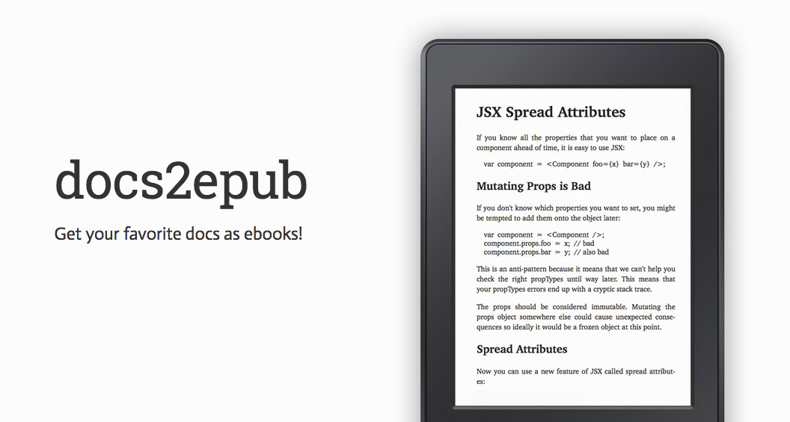

Get your favorite docs as ebooks!

# Library
* React [[epub]](http://javier.xyz/docs2epub/download/react.epub) [[html]](http://javier.xyz/docs2epub/download/react.html). [stable]
* Lodash [[epub]](http://javier.xyz/docs2epub/download/lodash.epub) [[html]](http://javier.xyz/docs2epub/download/lodash.html). [stable]
* Underscore [[epub]](http://javier.xyz/docs2epub/download/underscore.epub) [[html]](http://javier.xyz/docs2epub/download/underscore.html). [beta]
* express [[epub]](http://javier.xyz/docs2epub/download/express.epub) [[html]](http://javier.xyz/docs2epub/download/express.html). [beta]
* angular2 [[epub]](http://javier.xyz/docs2epub/download/angular2.epub) [[html]](http://javier.xyz/docs2epub/download/angular2.html). [alpha]

# Features
* Pluggable system to add more documentation sources.
* Uses [epub-gen](https://github.com/cyrilis/epub-gen) tuned for code.

# Future improvements
* Syntax highlight.

# Licence
MIT.
